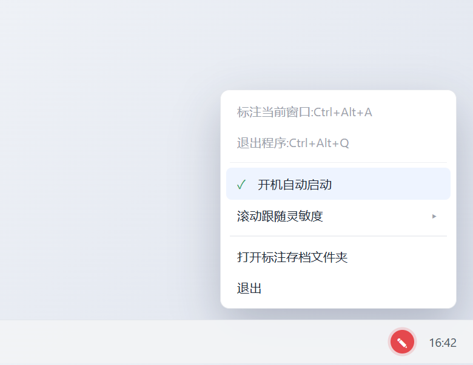

<div align="center">

# ✎ Window Annotator

**Hand-drawn annotations on any window — and they stick to the window.**

Draw arrows, highlight, and jot handwritten notes on top of *any* window:
a browser, a PDF, a chat app, your code editor. It's not a screenshot — the marks are alive:
move, resize, or scroll the window and the annotations follow along.


[中文](README.md) · [Install](#-install) · [Get started](#-get-started-in-3-steps) · [FAQ](#-faq)


</div>

---

## What is this

In one line: **it takes "scribbling on top of things" out of any single app and turns it into a system-wide ability.**

The idea comes from a friend's Obsidian plugin, *Crisp Annotations* — its hand-drawn arrows and
handwritten notes are lovely, but they only work inside Obsidian. So this tool brings the same
"annotate anything" feeling to the OS level: whatever window you're looking at, press a hotkey and
draw on it. All code is an independent implementation.

> Made for moments like: circling the key point on a web page while explaining it to a teammate,
> drawing while you narrate a screen recording, writing margin notes next to a PDF, or marking up
> a chunk of code — when the app itself has no pen.

## Features

| | |
|---|---|
| 🪟 **On any window** | Browser, PDF, chat, editor… if it's a window, you can mark it up |
| 🎯 **Marks follow the window** | Move or resize the window and annotations track it in real time — not a frozen screenshot |
| 📜 **Follows page scrolling** | Scroll the page and marks scroll with it (direction exact, magnitude tunable — see [FAQ](#-faq)) |
| ✏️ **Five hand-drawn tools** | Pen, hand-drawn arrow, highlighter, handwritten note, eraser — six colors |
| 💾 **Remembers automatically** | Saved per "app + window title"; close and reopen the window, the marks come back |
| 🫥 **Stays out of your way** | One tap and the overlay becomes click-through — keep using the window underneath |
| 🔔 **Lives in the tray** | A red ✎ icon; auto-start and scroll sensitivity are in the right-click menu |
| 🀄 **No licensing baggage** | Handwriting uses fonts built into Windows; no third-party assets bundled |

## Screenshots

**The toolbar in annotate mode** (pen / arrow / highlighter / note / eraser + six colors):


**The tray right-click menu** (auto-start and scroll sensitivity live here):



## 📦 Install

> Currently a dev build — you run it locally. A packaged, install-free `.exe` will come later.

```bash
git clone https://github.com/yunmin311/window-annotator.git
cd window-annotator
npm install
npm start
```

There's **no main window** — it sits quietly in the background. Success = a red ✎ icon appears in the
system tray, plus a notification telling you which hotkey is active. To launch it later, double-click
`启动 Window Annotator.vbs` in the project (no console window).

## 🚀 Get started in 3 steps

1. **Press `Ctrl+Alt+A`** — a canvas snaps onto the window you're *currently using*, and the toolbar slides in.
2. **Draw** — pick a tool and color; draw arrows, highlight, write. `Ctrl+Z` to undo.
3. **Press `Esc` (or "完成"/Done)** — the toolbar hides, the mouse goes click-through, and your marks stay pinned to the window.

| To do this | Do that |
|---|---|
| Write a handwritten note | Click `Aa` → cursor becomes a text caret → **click** on the window → a dashed box appears in place → type → click away or `Ctrl+Enter` to finish |
| Move / edit an existing note | In annotate mode, **drag** to move, **double-click** to edit |
| Erase a stroke | Pick the eraser, click or swipe over it |
| Make marks follow scrolling | Nothing to do — just scroll the page in view mode |
| Tune scroll follow speed | Tray right-click → "滚动跟随灵敏度" (Scroll sensitivity) → Slow / Normal / Fast |
| Start on boot | Tray right-click → "开机自动启动" (Start on login) |
| Quit the app | `Ctrl+Alt+Q`, or tray right-click → "退出" (Quit) |

## ❓ FAQ

**The hotkey does nothing?**
First make sure the app is **running** (is the red ✎ tray icon there?) — it's a background app, so no app, no hotkey.
If it's running and still nothing happens, `Ctrl+Alt+A` is probably taken by another app
(**it's the default screenshot hotkey for QQ**). In that case the app auto-falls back to `Ctrl+Alt+W`,
then `Ctrl+Shift+Alt+A` — the startup notification and tray tooltip tell you which one is live.

**Why is "follows scrolling" sometimes slightly off?**
Because this is an **overlay on top of a window it doesn't own** — it can't read how far the browser/PDF
has scrolled internally. So it intercepts your mouse wheel at the system level and converts "N wheel
notches" into pixels to shift the marks: **the direction is always right, but the magnitude is an
estimate** — different apps scroll a different number of pixels per notch. If the marks drift faster or
slower than the content, nudge the "Scroll sensitivity" one step in the tray.

**Does it slow down my PC?**
In the background it does one very cheap thing: realign the overlay every 16 ms. When you're not
annotating, it costs almost nothing.

## 🔧 How it works

<details>
<summary>Open for the three-layer design (for the curious)</summary>

The hard part of annotating *any* window is that **the overlay must precisely track a window you don't own.**
Three layers:

1. **Win32 bridge** (`src/win32.js`, calling system APIs directly via koffi — no native build):
   gets the window's **exact visible bounds** (DWM extended frame bounds, tighter than the classic
   `GetWindowRect`, excluding the invisible shadow margin), foreground / minimized / cloaked state, and process name.

2. **Tracking loop** (`main.js`): realigns the transparent overlay to the target window every 16 ms.
   It **only shows the overlay while the target is in the foreground** — a deliberate trick that sidesteps
   the classic z-order headache of "a topmost overlay covering other windows."

3. **Annotation canvas** (`overlay/`): a transparent, always-on-top window.
   - View mode is fully **click-through** (`setIgnoreMouseEvents + forward`), grabbing the mouse only when you hover the corner ✎;
   - The **hand-drawn look** comes from seeded jitter — each mark stores a seed so the wobble stays identical on redraw;
   - **Scroll-follow** uses a `WH_MOUSE_LL` low-level mouse hook to capture wheel deltas at the system level and
     shift marks per frame. Marks are stored in "content coordinates" (window coords at scroll = 0), so the whole layer moves consistently.

Annotations live in `data/annotations.json`, keyed by `app|window-title`; auto-start is delegated to the OS login item.

</details>

## 🚧 Known limits & roadmap

This is a working MVP. Current trade-offs, and where the polish is headed:

- **Scroll-follow is an estimate**: direction is exact, magnitude is dialed in via the sensitivity presets — not pixel-perfect.
- **Marks don't scale on window resize**: move/scroll follow works, but resizing the window won't scale the marks.
- **Marks hide when the target isn't foreground**: the stability that buys us the z-order trick; if that window scrolled while away, there'll be an offset on return.
- **Archived by window title**: switching browser tabs (title changes) is treated as a different window.
- Next up: **fluidity** (tighter tracking) and **visual polish**.

## 🙏 Credits

- Inspired by **letschips**' Obsidian plugin **Crisp Annotations** — the person who made "casual annotation" a joy to look at.
- Handwriting uses Ink Free / Segoe Print, built into Windows.

## 📄 License

[MIT](LICENSE) © 2026
