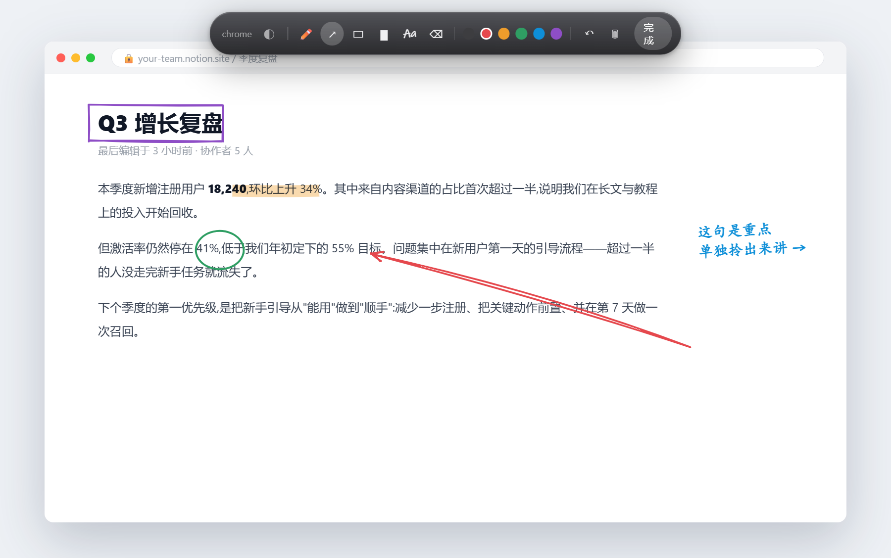
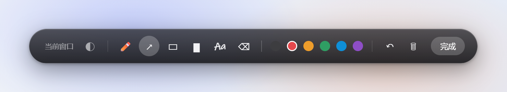

<div align="center">

# ✎ Window Annotator

**给任意窗口贴手绘标注，标注跟着窗口走。**

在浏览器、PDF、微信、代码编辑器——任何一个窗口上，随手画箭头、划重点、写便签。
它不是截图，是"活的"批注：窗口移动、缩放、上下滚动，标注都跟着一起走。


[English](README.en.md) · [下载安装](#-下载安装) · [三步上手](#-三步上手) · [常见问题](#-常见问题)



</div>

---

## 这是什么

一句话：**把"随手在东西上圈圈画画"这件事，从单个软件里解放出来，变成整台电脑都能用的能力。**

灵感来自朋友做的 Obsidian 插件 *Crisp Annotations*——它的手绘箭头和手写便签实在太好用了，
可惜只能在 Obsidian 里用。于是有了这个工具：把同样的"随手标注"搬到系统层，
你正在看的**任何一个窗口**，按一下快捷键就能在上面画。所有代码独立实现。

> 适合这些时刻：给同事讲一个网页时圈出重点、录屏演示时边讲边画、
> 读 PDF 时在旁边写批注、盯着一段代码时标记要改的地方——而这些软件本身都没有画笔。

## 能做什么

| | |
|---|---|
| 🪟 **贴在任意窗口** | 浏览器、PDF、聊天窗、编辑器……只要是个窗口就能标 |
| 🎯 **标注跟着窗口走** | 窗口移动、缩放，标注实时跟随；不是死在屏幕上的截图 |
| 📜 **跟着页面滚动** | 滚页面时标注按真实位置跟随，正文 / 侧栏还能各跟各的；读不到滚动的软件则钉在窗口上（见[常见问题](#-常见问题)）|
| ✏️ **六件手绘工具** | 画笔、手绘箭头、方框、荧光笔、手写便签、橡皮，六种颜色 |
| 💾 **自动记住** | 按"程序 + 窗口标题"存档，窗口关了再开，标注自动回来 |
| 🫥 **不挡你干活** | 画完按一下，鼠标穿透浮层，照常点击操作下面的窗口 |
| 🔔 **托盘常驻** | 右下角一个红色 ✎ 图标，开机自启、跟随开关都在右键菜单里 |
| 🀄 **零版权负担** | 手写体用 Windows 自带字体，不打包任何第三方素材 |

## 效果

**标注模式的工具条**（画笔 / 箭头 / 方框 / 荧光笔 / 手写便签 / 橡皮 + 六色）：



**工具条登场**（进入标注时，从一个小胶囊里「弹开」）：


## 📦 下载安装

> 目前是开发版，需要本地跑一下。之后会打包成免安装的 `.exe`。

```bash
git clone https://github.com/yunmin311/window-annotator.git
cd window-annotator
npm install
npm start
```

启动后**没有主窗口**，它安静地待在后台——看右下角托盘出现红色 ✎ 图标就是成功了，
同时会弹一条通知告诉你当前用哪个快捷键。以后想开，双击项目里的
`启动 Window Annotator.vbs` 即可（不弹黑框）。

## 🚀 三步上手

1. **按 `Ctrl+Alt+A`** —— 给你**当前正在用的窗口**贴上画布，工具条从顶部滑出。
2. **随手画** —— 选工具、选颜色，在窗口上画箭头、划重点、写字。`Ctrl+Z` 撤销。
3. **按 `Esc`（或点"完成"）** —— 收起工具条，鼠标恢复穿透，标注留在原地跟着窗口走。

| 想做的事 | 怎么做 |
|---|---|
| 写一句手写便签 | 点工具条 `Aa` → 光标变成文字光标 → 在窗口上**点一下**，原地出现虚线输入框 → 打字 → 点别处或 `Ctrl+Enter` 收起 |
| 移动 / 修改已有便签 | 标注模式下**拖动**移位、**双击**改字 |
| 擦掉某一笔 | 选橡皮，点它 / 从上面划过 |
| 淡化标注看清底下 / 缩放标注 | 画笔模式空白处滚鼠标滚轮:上滚变淡、下滚变实;想改成"滚轮缩放标注",点工具条左端的 ◐ / 🔍 小图标切换 |
| 让页面滚动时标注跟着滚 | 什么都不用做，查看模式下滚页面即可 |
| 临时关掉 / 打开跟随滚动 | 托盘右键 →「跟随页面滚动」勾选框 |
| 开机自动启动 | 托盘右键 →「开机自动启动」打勾 |
| 退出整个程序 | `Ctrl+Alt+Q`，或托盘右键 →「退出」 |

## ❓ 常见问题

**按了快捷键没反应？**
先确认程序**正在运行**（右下角有没有红色 ✎ 图标）——它是后台程序，不开就没有快捷键。
如果开着还没反应，多半是 `Ctrl+Alt+A` 被别的软件占了（**QQ 截图的默认快捷键正好是它**）。
这时程序会自动改用 `Ctrl+Alt+W`，再不行 `Ctrl+Shift+Alt+A`——**具体用哪个，以启动通知和托盘提示为准**。

**为什么有的软件能跟随滚动，有的不能？**
跟随滚动靠 Windows 的**无障碍接口（UI Automation）**去读目标窗口"现在滚到了哪"——
读得到就**按真实位置精确跟随**（浏览器、PDF、大多数笔记软件都行，甚至能分出正文区和侧栏，让每条标注各跟各的那一块）。
但**有些软件不把滚动位置交给无障碍接口**，这类暂时跟不了，标注会退回"钉在窗口上"（窗口移动 / 缩放照样跟）：

- **VS Code、Obsidian** 这类编辑器——它们用"虚拟滚动"（只渲染屏幕里那几行），接口里读不到滚动量；
- **ChatGPT 的对话区**——同理，那一长条消息流也是虚拟滚动的，读不到；
- 少数纯自绘界面的软件也可能读不到。

> 这块**正在做适配**：每多认出一种软件的滚动，就多一种能精确跟随；读不到的会稳妥退回钉在窗口上，不会乱跳。

**它会拖慢电脑吗？**
后台只做一件很轻的事：每 16 毫秒对齐一次浮层位置；只有真有标注的窗口在前台时，才会去读一次滚动。不标注时几乎不占资源。

## 🔧 它是怎么做到的

<details>
<summary>点开看三层结构（写给好奇的人）</summary>

外挂给"任意窗口"贴标注，难点在于**浮层要精确地跟住一个你并不拥有的窗口**。拆成三层：

1. **Win32 桥**（`src/win32.js`，用 koffi 直接调系统 API，免编译）：
   拿窗口的**精确可见边框**（DWM extended frame bounds，比传统 `GetWindowRect` 准，
   不含那圈看不见的阴影边距）、前台 / 最小化 / 隐身状态、进程名。

2. **追踪循环**（`main.js`）：每 16ms 把透明浮层对齐到目标窗口。
   **只在目标窗口位于前台时才显示浮层**——用这个取巧绕开了"置顶浮层会盖住其它窗口"的
   z-order 老大难问题。

3. **标注画布**（`overlay/`）：一个透明的置顶窗口。
   - 查看模式整窗**鼠标穿透**（`setIgnoreMouseEvents + forward`），只在你悬到右下角 ✎ 时临时接住鼠标；
   - **手绘感**来自种子化随机抖动——每个标注存一个 seed，重画时抖动一致，不会一帧一个样；
   - **跟随滚动**：用系统无障碍接口（UI Automation 的 ScrollPattern）读目标窗口的**真实滚动位置**，
     换算成像素平移标注。一个页面里的多个可滚动区（正文、侧栏……）分别识别，
     **每条标注只跟它当初画在的那一块**，滚出这块就裁掉不露头；读不到滚动的软件则退回钉在窗口上。

存档在 `data/annotations.json`，键是 `程序名|窗口标题`；开机自启交给系统登录项，自己不记状态。

</details>

## 🚧 已知边界与后续计划

这是个能用的 MVP，以下是当前的取舍，也是接下来要打磨的方向：

- **跟随滚动看软件**：读得到滚动位置的（浏览器 / PDF / 多数笔记软件）按真实位置精确跟随，正文 / 侧栏还能各跟各的；读不到的（VS Code / Obsidian / ChatGPT 对话区等虚拟滚动界面）退回钉在窗口上。**正在逐步适配更多软件。**
- **窗口缩放时标注不缩放**：跟随移动 / 滚动都没问题，但把窗口拉大拉小时，标注不会跟着放大缩小。
- **目标窗口不在前台时标注隐藏**：这是 z-order 取舍换来的稳定；离开期间若那个窗口滚动过，回来会有偏移。
- **按窗口标题区分存档**：好处是**浏览器切标签页会自动切成那一页的标注**、不会串页；代价是两个标题恰好相同的页面会共用一套标注。
- 下一步重点：**流畅度**（跟随更跟手）与**视觉打磨**。

## 🙏 致谢

- 灵感来自 **letschips** 的 Obsidian 插件 **Crisp Annotations**——把"随手标注"做得赏心悦目的那个人。
- 手写体使用 Windows 自带的 Ink Free / Segoe Print。

## 📄 License

[MIT](LICENSE) © 2026
